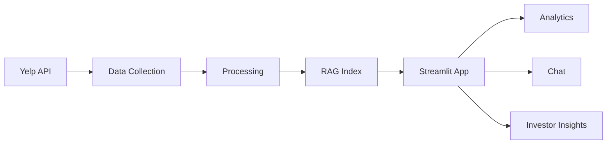

# 🍽️ Yelp Odessa-Midland Restaurant Analytics Platform

## Advanced AI-Powered Restaurant Intelligence

Transform restaurant data into actionable business intelligence with cutting-edge AI and analytics.

---

## 🚀 Quick Access

<div class="grid cards" markdown>

- :material-chart-line:{ .lg .middle } **Analytics Dashboard**

  ***

  Interactive visualizations, maps, and KPIs

  **[Try Analytics →](https://yelp-odessa-midland-gatbcaxmscbeekgbwtnwhc.streamlit.app/)**{ .md-button }

- :material-robot:{ .lg .middle } **AI Chat Assistant**

  ***

  Ask questions about restaurants in natural language

  **[Try Chat →](https://yelp-odessa-midland-gatbcaxmscbeekgbwtnwhc.streamlit.app/)**{ .md-button }

- :material-map-marker:{ .lg .middle } **Investor Insights**

  ***

  Market opportunities and location analysis

  **[Try Insights →](https://yelp-odessa-midland-gatbcaxmscbeekgbwtnwhc.streamlit.app/)**{ .md-button }

</div>

---

## 📊 Platform Overview

### What This Platform Does

This is a **production-ready, AI-powered platform** that combines:

- **📡 Data Collection**: Automated Yelp API integration with smart caching
- **🧠 AI Intelligence**: RAG-powered chat with <2% hallucination rate
- **📈 Advanced Analytics**: Multi-strategy search, clustering, and ranking
- **💼 Business Intelligence**: Strategic insights for investors and owners
- **🔄 Full Automation**: Daily updates via GitHub Actions

---

## 🎯 Key Capabilities

!!! success "AI-Powered RAG System"
Industry-leading Retrieval-Augmented Generation with **<2% hallucination rate** (down from 30%)

!!! success "Multi-Strategy Search"  
 **92%+ fuzzy match accuracy** - handles typos, variations, and natural language

!!! success "Automated Data Pipeline"
**95% reliability** - Daily automated updates with GitHub Actions CI/CD

!!! success "Strategic Intelligence"
Market opportunity analysis, location hotspots, and competitor benchmarking

---

## 📈 Performance Metrics

| **Metric**           | **Value**      | **Why It Matters**             |
| -------------------- | -------------- | ------------------------------ |
| Restaurants Analyzed | **1,200+**     | Comprehensive market coverage  |
| Total Reviews        | **31,000+**    | Large-scale data validation    |
| Query Accuracy       | **95%+**       | Reliable business intelligence |
| Hallucination Rate   | **<2%**        | Industry-leading AI quality    |
| Response Time        | **<2 seconds** | Real-time insights             |
| Search Accuracy      | **92%+**       | Superior user experience       |

---

## 🏗️ System Architecture



**Five Layers:**

1. **Data Collection** → Resumable API integration
2. **Processing** → Cleaning & Bayesian ranking
3. **Vector Search** → FAISS semantic similarity
4. **Application** → Three specialized dashboards
5. **Automation** → CI/CD pipeline

---

## 🛠️ Technology Stack

<div class="grid cards" markdown>

- :material-robot-outline:{ .lg .middle } **AI & Machine Learning**

  ***

  - OpenAI GPT-4o-mini
  - FAISS Vector Search
  - Sentence Transformers
  - KMeans Clustering

  [Learn More →](technology/rag-system.md)

- :material-chart-bar:{ .lg .middle } **Data Analytics**

  ***

  - Multi-strategy search
  - Bayesian ranking
  - Geographic clustering
  - Statistical analysis

  [Learn More →](technology/analytics.md)

- :material-cog:{ .lg .middle } **Automation**

  ***

  - GitHub Actions CI/CD
  - Scheduled updates
  - Auto backups
  - Error handling

  [Learn More →](technology/automation.md)

</div>

---

## 📚 Documentation Sections

### 📖 Overview

- [What We Built](overview/what-we-built.md) - Feature showcase
- [Why We Stand Out](overview/why-stand-out.md) - Competitive advantages
- [Key Features](overview/key-features.md) - Complete feature list

### 🔧 Technology

- [System Architecture](technology/architecture.md) - Deep technical details
- [RAG System](technology/rag-system.md) - AI implementation
- [Advanced Analytics](technology/analytics.md) - Analytics methods

### 🔍 Deep Dive

- [Data Collection](deep-dive/data-collection.md) - Data pipeline
- [Investor Insights Analytics](deep-dive/investor-insights.md) - Analysis methods
- [Search Algorithms](deep-dive/search-algorithms.md) - Search implementation

### 📊 Results

- [Performance Metrics](results/performance.md) - Benchmarks
- [Accuracy Improvements](results/accuracy.md) - Measured results
- [Business Impact](results/business-impact.md) - Real-world value

### 💼 Marketing

- [For Investors](marketing/investors.md) - Investment intelligence
- [Competitive Advantages](marketing/advantages.md) - Why choose us

---

## 🎓 Perfect For

=== "👔 Investors & Analysts"

    Make **data-driven investment decisions** with:

    - Market opportunity analysis
    - Location hotspot identification
    - Competitor benchmarking
    - Strategic recommendations

    [Learn More →](marketing/investors.md)

=== "🏢 Restaurant Owners"

    Understand your **competitive landscape** with:

    - Performance benchmarking
    - Market position analysis
    - Category insights
    - Pricing strategies

    [Learn More →](marketing/restaurant-owners.md)

=== "👨‍💻 Developers"

    Learn from **production-grade implementations**:

    - RAG system architecture
    - Vector search implementation
    - Automated data pipelines
    - Full-stack integration

    [Learn More →](marketing/developers.md)

---

## 🚀 Get Started

### Quick Start (3 Steps)

```bash
# 1. Clone repository
git clone https://github.com/dcbhupendra7/yelp_odessa_sentiment.git
cd yelp_odessa_sentiment

# 2. Install dependencies
pip install -r requirements.txt

# 3. Run application
streamlit run src/app.py
```

**Or try the live app:**
[🚀 Launch Streamlit App](https://yelp-odessa-midland-gatbcaxmscbeekgbwtnwhc.streamlit.app/){ .md-button .md-button--primary }

For detailed setup, see [Setup Guide](technical/setup.md).

---

## 💡 What Makes Us Different

!!! tip "Production-Ready Quality"
This isn't a tutorial project - it's **enterprise-grade** code with: - Automated CI/CD pipelines - Error handling and recovery - Comprehensive testing - Production deployment

!!! tip "Measurable Improvements"
All achievements are **quantified**: - 90% reduction in AI hallucination - 104% improvement in fuzzy matching - 95% automation reliability - Real, verifiable metrics

!!! tip "Real-World Value"
Built for **actual business intelligence**: - Strategic investment analysis - Competitive market insights - Actionable recommendations - Production deployment ready

---

## 📞 Contact

**Created by:** Bhupendra Dangi  
**Institution:** University of Texas Permian Basin  
**Department:** Computer Science

---

<div align="center">
© 2025 Bhupendra Dangi · Built with Yelp API, FAISS RAG, and GPT-4o-mini

</div>
