# System Architecture

## 🏗️ Complete System Overview

The Yelp Odessa-Midland Restaurant Analytics Platform follows a five-layer architecture designed for scalability, reliability, and performance.

---

## 📐 Architecture Diagram

```mermaid
graph TB
    Start([Start]) --> YelpAPI[Yelp Fusion API]
    
    YelpAPI --> Fetch[yelp_fetch_reviews.py<br/>Fetch Business Data]
    Fetch --> Cache[Cache JSON Pages<br/>data/cache/]
    Cache --> RawCSV[Raw CSV<br/>data/raw/businesses.csv]
    
    RawCSV --> Process[prepare_business_metrics.py<br/>Calculate Rankings]
    Process --> Bayesian[Bayesian Weighted Rating<br/>Popularity Scoring]
    Bayesian --> RankedCSV[Ranked CSV<br/>data/processed/businesses_ranked.csv]
    
    RankedCSV --> BuildRAG[build_rag_index.py<br/>Build RAG Index]
    BuildRAG --> Embeddings[Sentence Transformers<br/>all-MiniLM-L6-v2]
    Embeddings --> FAISS[FAISS Vector Index<br/>data/processed/rag/]
    
    FAISS --> AutoRefresh{auto_refresh_data.py<br/>Data Refresh System}
    AutoRefresh -->|Manual| ManualRefresh[Full/Incremental Refresh]
    AutoRefresh -->|Scheduled| CronJob[Cron Job<br/>Daily at 2 AM]
    AutoRefresh -->|Check| StatusCheck[Data Freshness Check]
    
    RankedCSV --> Streamlit[Streamlit App<br/>app.py]
    FAISS --> Streamlit
    
    Streamlit --> Analytics[📊 Analytics Page]
    Streamlit --> Chat[💬 Chat Page]
    Streamlit --> Investor[💰 Investor Insights Page]
    
    Analytics --> Filters[Filters:<br/>City, Price, Rating, Reviews]
    Filters --> Viz1[KPI Metrics]
    Filters --> Viz2[Ratings Distribution]
    Filters --> Viz3[Price Analysis]
    Filters --> Viz4[Category Analysis]
    Filters --> Viz5[Interactive Map]
    Filters --> Export[CSV Export]
    
    Chat --> RAGSystem[RAG Retrieval System]
    RAGSystem --> TabularRetrieval[Tabular Retrieval<br/>Ranked Candidates]
    RAGSystem --> VectorSearch[FAISS Vector Search<br/>Semantic Similarity]
    VectorSearch --> LLM[OpenAI GPT-4o-mini<br/>Optional]
    LLM --> ChatResponse[Context-Aware Responses<br/>with Citations]
    
    Investor --> MarketAnalysis[Market Opportunity Analysis]
    Investor --> LocationClustering[Geographic Clustering<br/>K-Means]
    Investor --> CategoryGaps[Category Gap Analysis]
    Investor --> InvestmentInsights[Investment Recommendations]
```



---

## 🔄 Data Flow

### 1. Data Collection Layer

**Component**: `yelp_fetch_reviews.py`

**Responsibilities:**
- Yelp API integration with rate limiting
- Resumable caching system
- Pagination handling (50 results per page)
- City-category matrix traversal
- Data flattening and normalization

**Output**: Raw JSON cache files and aggregated CSV

---

### 2. Data Processing Layer

**Component**: `prepare_business_metrics.py`

**Responsibilities:**
- Duplicate removal (by business ID)
- Missing value handling with user-friendly replacements
- Bayesian weighted rating calculation
- Popularity scoring (logarithmic scaling)
- Composite ranking algorithm

**Output**: Clean CSV files and ranked datasets

---

### 3. RAG Index Layer

**Component**: `build_rag_index.py`

**Responsibilities:**
- Text document preparation
- Embedding generation (Sentence Transformers)
- FAISS index building
- Metadata storage

**Output**: FAISS vector index and document store

---

### 4. Application Layer

**Component**: `src/app.py` + `src/pages/`

**Responsibilities:**
- Streamlit web interface
- Three specialized dashboards:
  - Analytics Dashboard
  - RAG Chat Assistant
  - Investor Insights
- User interaction handling
- Data visualization

**Output**: Interactive web application

---

### 5. Automation Layer

**Component**: `.github/workflows/auto-refresh.yml` + `auto_refresh_data.py`

**Responsibilities:**
- Scheduled data refresh (daily)
- Data integrity validation
- Automatic backups
- Error recovery
- CI/CD integration

**Output**: Continuously updated dataset

---

## 🧩 Component Details

### Analytics Dashboard (`pages/analytics.py`)

**Features:**
- KPI metrics display
- Interactive filtering
- Chart visualizations (Plotly)
- Geographic mapping (PyDeck)
- CSV export functionality

**Data Sources:**
- `businesses_ranked.csv`
- Real-time filtering and aggregation

---

### RAG Chat Assistant (`pages/chat.py`)

**Features:**
- Natural language query processing
- Multi-strategy search (7 layers)
- Vector similarity search (FAISS)
- LLM response generation (GPT-4o-mini)
- Citation and source tracking

**Components:**
- `utils/rag.py` - Retrieval logic
- `utils/llm_openai.py` - LLM integration
- FAISS index for semantic search

---

### Investor Insights (`pages/investor_insights.py`)

**Features:**
- Market opportunity analysis
- Location hotspot clustering (KMeans)
- Competitor benchmarking
- Strategic recommendations

**Analytics Methods:**
- Category gap identification
- Geographic clustering
- Statistical benchmarking

---

## 🔐 Security & Environment

### Environment Variables

```bash
YELP_API_KEY          # Required for data collection
OPENAI_API_KEY        # Optional, for enhanced chat
DATA_DIR              # Optional, override data directory
RAG_DOC_TABLE         # Optional, override document table
EMBED_MODEL           # Optional, override embedding model
```

### Security Measures

- API keys stored in environment variables
- GitHub Secrets for CI/CD
- No sensitive data in code
- Secure error handling

---

## ⚡ Performance Optimizations

### Caching Strategy

- **Resumable API cache**: JSON files per page
- **Streamlit caching**: `@st.cache_data` decorators
- **Manifest tracking**: Avoids redundant API calls

### Query Optimization

- **Multi-strategy search**: Fast exact matches first
- **Vector index**: FAISS for semantic similarity
- **Deduplication**: Efficient result merging

### Data Processing

- **Batch processing**: Process data in chunks
- **Incremental updates**: Only fetch new/changed data
- **Lazy loading**: Load data only when needed

---

## 📊 Scalability Considerations

### Current Capacity

- **1,200+ restaurants**: Efficiently handled
- **31,000+ reviews**: Fast processing
- **36+ categories**: Easy expansion

### Future Scalability

- **Multi-city support**: Architecture ready
- **Additional data sources**: Modular design
- **API integration**: RESTful architecture ready
- **Microservices**: Components can be separated

---

## 🛠️ Technology Stack

| Layer | Technology | Purpose |
|-------|-----------|---------|
| **Language** | Python 3.12 | Core development |
| **Web Framework** | Streamlit | Interactive UI |
| **Vector DB** | FAISS (CPU) | Similarity search |
| **Embeddings** | Sentence Transformers | Text-to-vector |
| **LLM** | OpenAI GPT-4o-mini | Response generation |
| **Visualization** | Plotly, PyDeck | Charts and maps |
| **Automation** | GitHub Actions | CI/CD pipeline |
| **Data Processing** | Pandas, NumPy | Data manipulation |
| **ML** | scikit-learn | Clustering algorithms |

---

## 📈 System Metrics

### Performance Benchmarks

- **Data Collection**: 18 min average (full refresh)
- **Data Processing**: 2 min average
- **RAG Index Building**: 5 min average
- **Query Response**: <2 seconds average
- **Page Load**: <1 second

### Reliability Metrics

- **Automation Success Rate**: 95%
- **Data Freshness**: Daily updates
- **Error Recovery**: Automatic backups
- **Uptime**: High availability

---

## 🔄 Maintenance & Updates

### Automated Processes

- **Daily Data Refresh**: GitHub Actions scheduler
- **Automatic Backups**: Before each update
- **Error Alerts**: Notification on failures
- **Health Monitoring**: Status reports

### Manual Processes

- **Code Updates**: Standard git workflow
- **Configuration Changes**: Update `mkdocs.yml` or config files
- **Model Updates**: Change embedding model if needed

---

## 📚 Further Reading

- [RAG System Details](rag-system.md)
- [Data Collection Process](deep-dive/data-collection.md)
- [Investor Insights Analytics](deep-dive/investor-insights.md)
- [Setup Guide](../technical/setup.md)

---

**Ready to explore?** Try our [Interactive Demo](../interactive-demo.md) or [Launch the App](https://yelp-odessa-midland-gatbcaxmscbeekgbwtnwhc.streamlit.app/)

